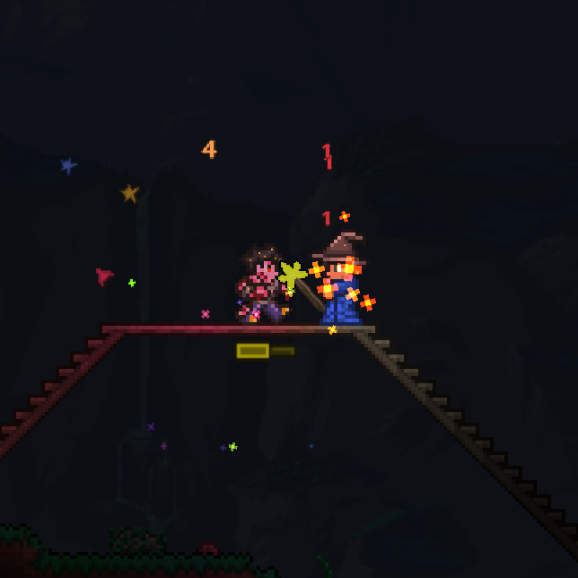
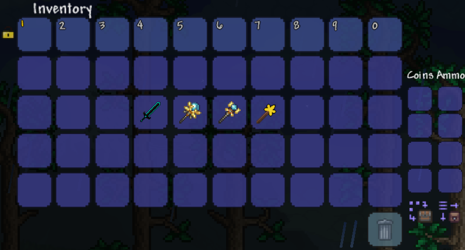
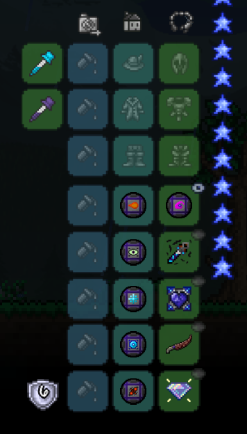

# Magic-Mod
> Magic Mod, a mod for Terraria using tModLoader.

## Table of contents
* [General Info](#general-Info)
* [Screenshots](#screenshots)
* [Changelog/Releases](#changelog)
* [Mod Wiki](https://github.com/Zephyr-dot/Magic-Mod/wiki)
* [Mod Content](#mod-Content)
* [Project Status](#project-Status)
* [Download Counter!](#download-counter)
* [Contact](#contact)

## General info
This a Terraria mod made by ~~me~~ Zephyr, a solo game developer and rising programmer.
The Mod is designed to enhance Terraria's already advanced Magic system by giving players new ways to be a Mage through new items, effects, enemies, and the like.
Magic-Mod is not meant to give players super overpowered items to trivialize the game, it is simply supposed to enhance the Terraria experience with more options and ways to play. (At some point, Boss fights post Moon-Lord could be added, in which case new, more powerful items would need to be available to the player.)

Currently (As of July 17, 2020), the mod is only 2 days into development.
I have not made a mod before this one, for any game, but I am learning how to use tModLoader to make this mod as awesome as possible! Just stick with me and eventually at some point you maybe just might possibly get some new boss fights or something cool like that. ;)

## Screenshots

## Changelog
version 0.1.5
[Latest Releases](https://github.com/Zephyr-dot/Magic-Mod/releases)

## Mod Content
* New Weapon Type
* New Accessory Combos
* New Mana Systems
* New Enemies
* New Items
* New Recipes
* New Buffs and Debuffs
* Much, much more
* Ane even MUCH more in the future!

## Project Status
Project is: DEFINITELY in progress. This means there will be the occasional bug or balance issue, but it also means there will be LOTS of new content coming shortly!

## Download Counter
Magic Mod has had over 500 downloads since release!
Spread the word about Magic Mod!

## Contact
Discord: @Zephyr-Dot#6200 - feel free to contact me about bugs/suggestions/questions/etc.! You can find me on the [tModLoader](https://www.tmodloader.net/) Discord server, just @ping me or find me and send a private message!
